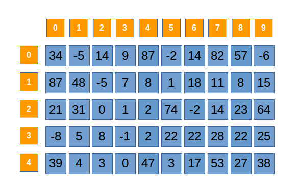

Tablouri bidimensionale
1. Declrare
    int a[101][101], n, m;
    n = 2; lini
    m = 3; coloane
    
    a = v[i][j];
    //i = pos pe coloana
    //j = pos pe linie
    citire:
        for (int i = 0; i < n; i++) {
            for (int j = 0; j j < n; j++) {
                cin >> a[i][j];
            }
        }
    // afisare
    for (int i = 0; i < n; i++) {
        for (int j = 0; j < m; j++) {
            cout << a[i][j];
        }
        cout << "\n;
    }