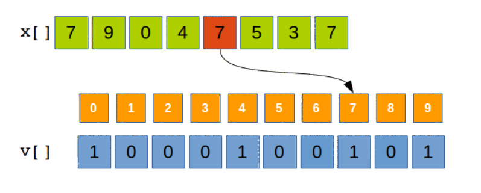
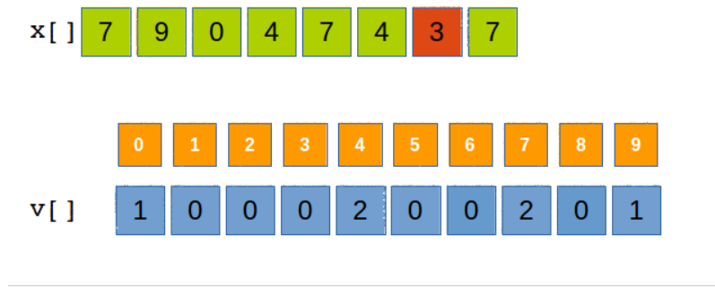

vectori caracteristici si de frecventa
vector de caracteristica bool x[1001]
e de tip bool si indica daca o valoare apare sau nu intr-un sir

implementare

se dau n si v[1001], tablourile deja citite
bool x[1001] = {false};
for (int i = 0; i < n; i++) {
    x[v[i]] = true;
}

vector de frecventa de tip int x[1001] = {0}
si ne spune de cate ori apare fiecare valoare intr-un vector

implementare 

se dau n si v[1001], tablourile deja citite
int x[1001] = {0};
for (int i = 0; i < n; i++) {
    x[v[i]]++;
}